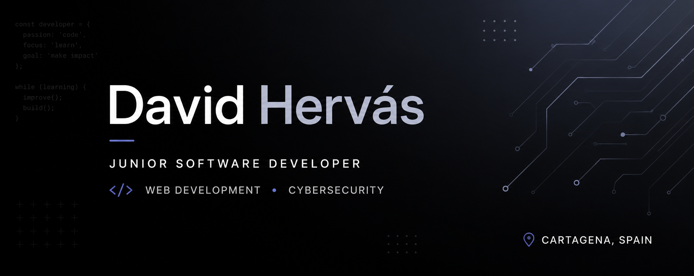

  

<h1 align="center">David Hervás</h1>

Junior Software Developer • Cybersecurity

Building secure software. Learning every day. Always improving.

---

## About

I'm a Junior Software Developer from Cartagena, Spain, with a background in Web Application Development and Cybersecurity.

I enjoy solving technical challenges and continuously improving my skills through personal projects.

My main interests are secure software development, digital forensics and cybersecurity.

I'm currently looking for my first opportunity as a Software Developer where I can learn from experienced developers, contribute to meaningful projects and continue growing professionally.

---

## Tech Stack

---

## Projects

Coming soon.

---

## Current Focus

- JavaScript
- React
- TypeScript
- Cybersecurity
- Personal Projects

---

## Contact

Email: hervasegea@gmail.com
